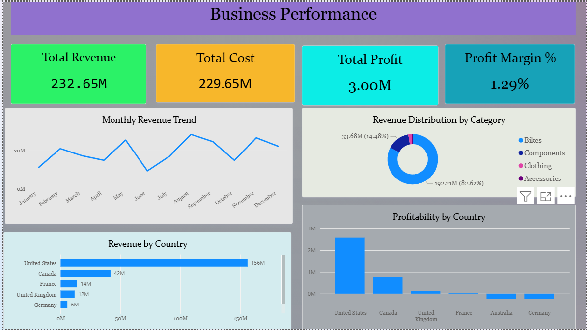

# 📊 End-to-End Sales Analytics Platform


---

## 📌 Project Overview

This project demonstrates an end-to-end Sales Analytics solution built using **PostgreSQL, SQL, Python, and Power BI**. The solution transforms raw sales data into meaningful business insights through data engineering, SQL analytics, KPI reporting, and interactive dashboards.

---

## 🎯 Business Objective

The objective of this project is to analyze sales performance across products, countries, and sales representatives to support data-driven business decisions. The dashboard enables stakeholders to monitor KPIs, identify business trends, evaluate profitability, and measure sales target achievement.

---

## 🛠️ Technology Stack

* PostgreSQL
* SQL
* Python (Pandas)
* Power BI
* DAX

---

## 📂 Dataset

The project uses a relational database consisting of the following tables:

* 📦 Sales
* 🛍️ Product
* 🌍 Region
* 👨‍💼 Salesperson
* 🎯 Targets

---

## ⚙️ Project Workflow

```text
Raw CSV Data
      │
      ▼
Data Cleaning (Python)
      │
      ▼
PostgreSQL Database
      │
      ▼
SQL Analysis
      │
      ▼
Business KPI Analysis
      │
      ▼
Power BI Dashboard
      │
      ▼
Business Insights
```

---

## 📈 Executive KPIs

* 💰 Total Revenue
* 💵 Total Cost
* 📊 Total Profit
* 📉 Profit Margin

---

## 📊 Business Analysis

* Revenue by Product Category
* Revenue by Country
* Revenue by Salesperson
* Profit by Salesperson
* Monthly Revenue Trend
* Top 10 Products
* Bottom 10 Products
* Target Achievement Analysis

---

# 📸 Dashboard Preview

## 📊 Executive Dashboard



---

## 👥 Sales Performance Dashboard


---

## 🔍 Key Business Insights

* Generated **232.65M** in total revenue.
* Achieved an overall profit of **3.00M**.
* Overall profit margin reached **1.29%**.
* The **Bikes** category generated the highest revenue.
* The **United States** was the top revenue-generating market.
* Germany and Australia recorded comparatively lower profitability.
* Sales performance varied across regions, highlighting opportunities to improve target achievement.

---

## 📁 Repository Structure

```text
Sales-Analytics-Platform
│
├── Dashboard
│   ├── Executive_Dashboard.png
│   ├── Sales_Performance_Dashboard.png
│   └── Sales.pbix
│
├── Database
│   └── Sales_Analytics_Database.sql
│
├── Python
│   └── Sales_Analytics_Data_Preparation.ipynb
│
├── Report
│   └── Sales_Analytics_Report.pdf
│
├── LICENSE
└── README.md
```

---

## 🚀 Getting Started

1. Clone the repository.
2. Restore the PostgreSQL database using the provided SQL dump.
3. Open the Power BI dashboard (.pbix) file.
4. Refresh the data source if required.
5. Explore the dashboards and business insights.

---

## 🔮 Future Improvements

* Sales Forecasting
* Customer Segmentation
* Automated ETL Pipeline
* Real-Time Dashboard
* Interactive Drill-through Analysis

---

## 👨‍💻 Author

**Shivam Mishra**

Data Analyst | SQL | PostgreSQL | Python | Power BI
